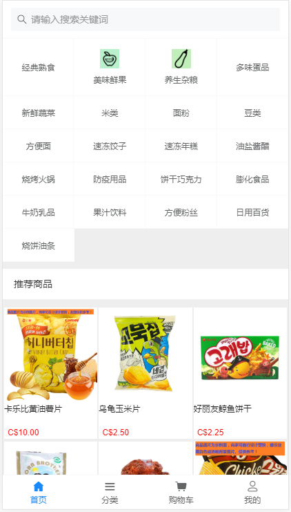

## vue + vant + vue-router + vuex

>此项目只有前端项目，后端接口没有出来，仅供大家参考    


## 特性
-支付宝授权登录
-支付宝网页支付
-购物车
-商品展示

## 手机预览

可以手机扫码以下二维码访问手机端 demo：   




## 技术栈

- vue
- [vue cli 3](https://cli.vuejs.org/zh/guide/installation.html)
- [vant](https://github.com/youzan/vant)
- less
- [vue-router](https://router.vuejs.org/zh/installation.html)
- [axios](https://github.com/axios/axios)
- [babel-plugin-import](https://github.com/ant-design/babel-plugin-import)


## 快速上手

```
# 安装 Vue Cli 3
npm install -g @vue/cli

npm install

npm run serve

npm run build
```

调整src/config/env.js的配置信息
```
baseUrl: 域名地址
dataSources：数据源(local=本地)
```


```

